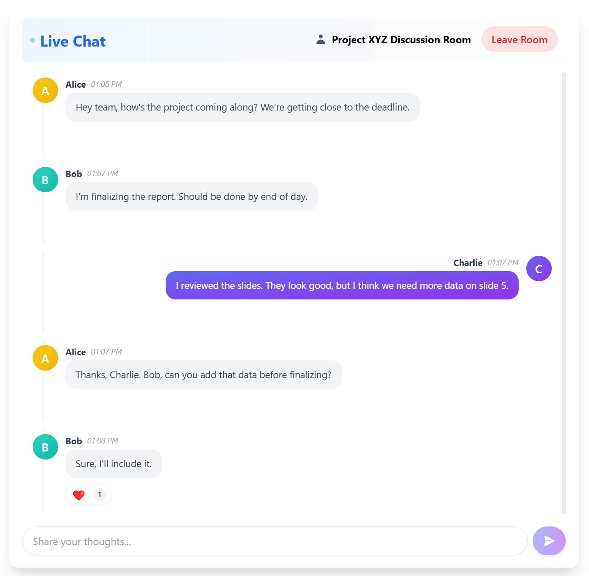

# Real-Time Chat Application

A powerful, real-time chat application built from scratch using [Next.js](https://nextjs.org/) and [HPKV's WebSocket pub/sub feature](https://hpkv.io/blog/2025/03/real-time-pub-sub). This application demonstrates how to build a scalable, real-time communication system without complex backend infrastructure.




## Features

- **Real-time messaging**: Messages appear instantly for all users in a chat room
- **WebSocket-based communication**: Efficient real-time updates without polling
- **Client-side focused architecture**: Minimal backend requirements
- **Persistent storage**: Messages are stored in HPKV key-value storage
- **Multiple chat rooms**: Create and join different chat rooms
- **Message history**: Chat history is stored and loaded when joining a room

## Setup and Installation

### Prerequisites

- Node.js 16+ and npm
- HPKV API key for WebSocket access. [Get a free API key](https://hpkv.io/signup) 

### Installation Steps

1. Clone the repository:
   ```bash
   git clone https://github.com/hpkv-io/showcase-realtime-chat.git
   cd showcase-realtime-chat
   ```

2. Install dependencies:
   ```bash
   npm install
   ```

3. Create a `.env.local` file in the project root:
   (You can find these values from [HPKV Dashboard](https://hpkv.io/dashboard))
   ```
   HPKV_API_KEY=your_api_key_here
   HPKV_BASE_URL=your_api_base_url
   NEXT_PUBLIC_WS_URL=your_websocket_base_url
   ```

4. Start the development server:
   ```bash
   npm run dev
   ```

5. Open [http://localhost:3000](http://localhost:3000) in your browser

## Deployment

You can deploy this application to Vercel or any other Next.js compatible hosting:

### Vercel Deployment

1. Install Vercel CLI:
   ```bash
   npm install -g vercel
   ```

2. Deploy to Vercel:
   ```bash
   vercel
   ```

3. Set environment variables in the Vercel dashboard:
   - `HPKV_API_KEY`: Your HPKV API key
   - `HPKV_BASE_URL`: Your HPKV API Base Url
   - `NEXT_PUBLIC_WS_URL`: Your HPKV Websocket Base Url

## Architecture

The application follows a client-centric architecture with minimal backend components:

```
┌─────────────────────────────────┐
│                                 │
│  Next.js Frontend Application   │
│                                 │
│  ┌─────────────────┐            │
│  │                 │            │
│  │  React UI       │            │
│  │  Components     │            │
│  │                 │            │
│  └────────┬────────┘            │
│           │                     │
│  ┌────────▼────────┐            │
│  │                 │            │
│  │  Chat Client    │            │
│  │                 │            │
│  └────────┬────────┘            │
│           │                     │
│  ┌────────▼────────┐            │
│  │                 │            │
│  │  WebSocket      │            │
│  │  Client         │            │
│  │                 │            │
│  └────────┬────────┘            │
│           │                     │
└───────────┼─────────────────────┘
            │
┌───────────▼─────────────────────┐
│                                 │
│  API Routes (for token auth)    │
│                                 │
└───────────┬─────────────────────┘
            │
┌───────────▼─────────────────────┐
│                                 │
│  HPKV WebSocket Service         │
│                                 │
│  ┌─────────────────┐            │
│  │  chat:{roomId}  │            │
│  │  keys           │            │
│  └─────────────────┘            │
│                                 │
│  ┌─────────────────┐            │
│  │  chatrooms      │            │
│  │  registry       │            │
│  └─────────────────┘            │
│                                 │
└─────────────────────────────────┘
```
### Key Components:

1. **React UI Components**: Handle the user interface for chatrooms and messages
2. **Chat Client**: Manages chat logic, connection state, and message handling
3. **WebSocket Client**: Handles low-level WebSocket communication with HPKV
4. **API Routes**: Generate tokens for WebSocket authentication
5. **HPKV Service**: Provides the WebSocket pub/sub functionality and key-value storage

## Concepts
This application uses HPKV key value database as the only required service to build chat functionality. It utilizes HPKV's bi-directional websocket to implement a pub/sub based chat application with persisitence.


## Code Design

The application is structured around several key components:

### Core Classes

- **HPKVWebsocketClient**: Handles WebSocket connection and notifications
- **ChatClient**: Manages chat rooms, messages, and provides a high-level API
- **ChatContext**: Provides React context for sharing the chat client across components

### React Components

- **ChatroomsManager**: UI for listing, creating, and joining chat rooms
- **Chatroom**: UI for displaying messages and sending new messages
- **MessageItem**: UI for rendering individual chat messages

### Key Interfaces

```typescript
// Chat Message structure
export interface ChatMessage {
    sender: string;
    message: string;
    timestamp: number;
    id?: string;
}

// Chat Room structure
export interface ChatRoom {
    id: string;
    name: string;
    createdAt: number;
}
```

## Code Snippets

### WebSocket Client

```typescript
// Connect to WebSocket and subscribe to notifications
public async connect(token: string): Promise<void> {
    // Close existing connection if any
    this.close();
    
    // Connect to WebSocket server
    this.websocket = new WebSocket(`wss://api.hpkv.io/ws?token=${token}`);
    
    return new Promise((resolve, reject) => {
        // Set up event handlers
        this.websocket.onopen = () => {
            console.log('WebSocket connection established');
            resolve();
        };
        
        this.websocket.onerror = (error) => {
            console.error('WebSocket error:', error);
            reject(error);
        };
        
        this.websocket.onmessage = (event) => {
            this.handleMessage(event);
        };
    });
}
```

### Chat Room Management

```typescript
// Create a new chat room
public async createChatroom(roomId: string, roomName?: string): Promise<void> {
    const response = await this.hpkvClient.get('chatrooms');
    
    // Parse the response.value which comes as a string
    let chatroomsRegistry: { chatrooms: ChatRoom[] } = { chatrooms: [] };
    
    if (response.value) {
        try {
            chatroomsRegistry = JSON.parse(response.value);
        } catch (parseError) {
            console.error("Error parsing chatrooms data:", parseError);
        }
    } 

    // Make sure chatroomsRegistry has the expected structure
    if (!chatroomsRegistry || !Array.isArray(chatroomsRegistry.chatrooms)) {
        chatroomsRegistry = { chatrooms: [] };
    }

    // Check if roomId already exists in the registry
    if (chatroomsRegistry.chatrooms.some(room => room.id === roomId)) {
        throw new Error(`Chat room with this ID already exists: ${roomId}`);
    }

    // Create the chat room key with empty messages array
    const chatRoomKey = `chat:${roomId}`;
    const emptyMessagesData = JSON.stringify({ messages: [] });
    await this.hpkvClient.insert(chatRoomKey, emptyMessagesData);
    console.log(`Initialized empty messages array for new room: ${roomId}`);

    // Add the room to the registry
    const roomInfo = {
        id: roomId,
        name: roomName || roomId,
        createdAt: Date.now()
    };

    chatroomsRegistry.chatrooms.push(roomInfo);

    // Update the chatrooms registry - always stringify
    const chatroomsData = JSON.stringify(chatroomsRegistry);
    await this.hpkvClient.insert('chatrooms', chatroomsData);
}
```

### Sending and Receiving Messages

```typescript
// Send a message to the current room
public async sendMessage(messageText: string): Promise<void> {
    if (!this.roomId) {
        throw new Error('No room joined');
    }

    try {
        // Get username from sessionStorage
        const username = typeof window !== 'undefined' 
            ? sessionStorage.getItem('username') || 'Anonymous' 
            : 'Anonymous';
        
        // Create the new message
        const newMessage: ChatMessage = {
            sender: username,
            message: messageText,
            timestamp: Date.now(),
            id: `msg_${Date.now()}_${Math.random().toString(36).substr(2, 9)}`
        };
        
        // Get the chat room key
        const chatRoomKey = `chat:${this.roomId}`;
        
        // Fetch current messages for the room
        let existingMessages: ChatMessage[] = [];
        try {
            const response = await this.hpkvClient.get(chatRoomKey);
            if (response.value) {
                try {
                    const data = JSON.parse(response.value);
                    existingMessages = Array.isArray(data.messages) ? data.messages : [];
                } catch (parseError) {
                    console.error("Error parsing existing messages:", parseError);
                }
            }
        } catch (error) {
            console.error("Error fetching existing messages:", error);
        }
        
        // Append the new message
        const updatedMessages = [...existingMessages, newMessage];
        
        // Update the chat room with all messages
        const messageData = JSON.stringify({ messages: updatedMessages });
        await this.hpkvClient.insert(chatRoomKey, messageData);
    } catch (err) {
        console.error('Failed to send message:', err);
        throw err;
    }
}
```

## How It Works

1. **Authentication**: When a user joins a chat room, the application requests a WebSocket token from an API endpoint.

2. **Connection**: The token is used to establish a WebSocket connection to HPKV.

3. **Subscriptions**: The connection subscribes to updates for specific keys relevant to the chat room.

4. **Real-time Updates**: When data changes, HPKV pushes notifications through the WebSocket connection.

5. **UI Updates**: The application processes these notifications and updates the UI accordingly.

## License

This project is licensed under the MIT License - see the LICENSE file for details.
